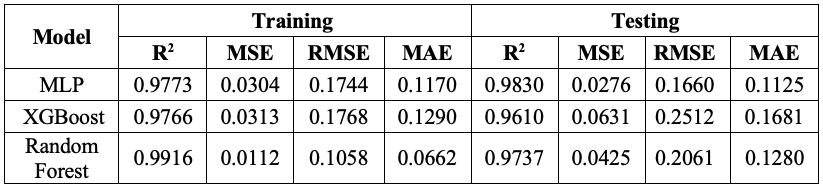
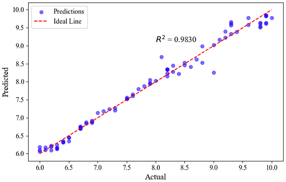
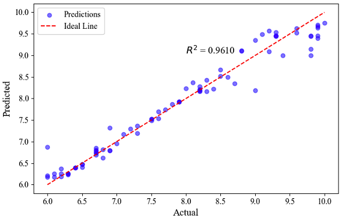
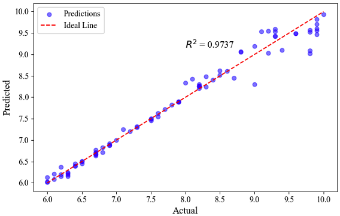

# Training Models

This code trains three different machine learning models—Multilayer Perceptron (MLP), eXtreme Gradient Boosting (XGBoost), and Random Forest (RF)—to predict pH levels based on a dataset of extracted color channel values. It also includes visualizations of the prediction results for performance comparison. In the final stage, each trained model is converted into TensorFlow Lite (TFLite) format to enable integration into a mobile application.

The table below summarizes the performance results of each model.

The figures below illustrate the actual versus predicted pH values for each model: (1) Multilayer Perceptron (MLP), (2) eXtreme Gradient Boosting (XGBoost), and (3) Random Forest (RF).

Part of the thesis entitled: "Development of a Non-invasive Vision-based Halochromic Sensor System for Chronic Wound Monitoring"
